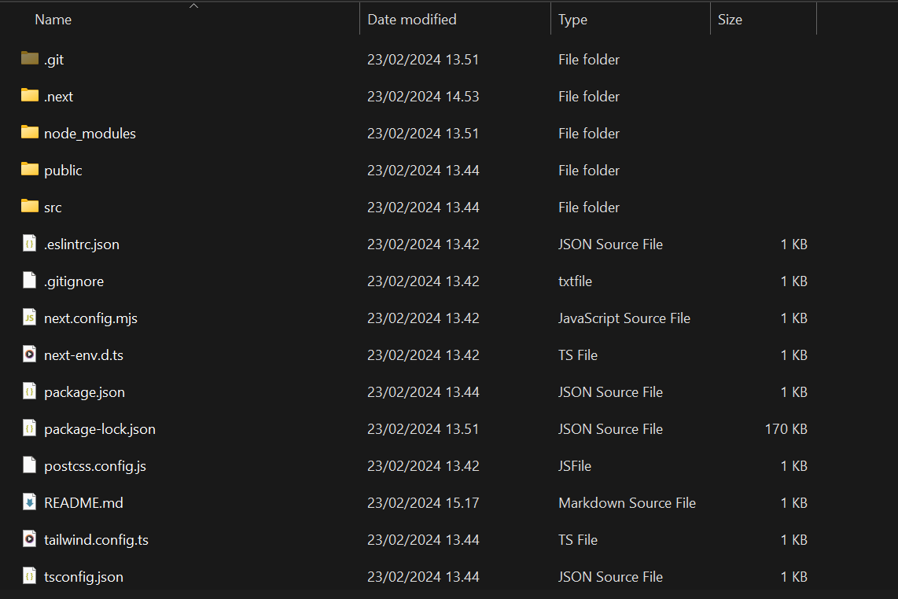
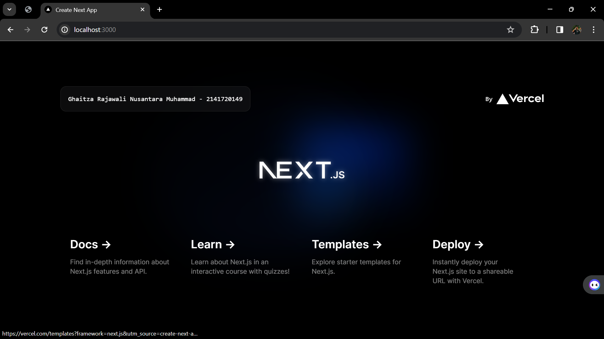

| Report Pemrograman Berbasis Frame |
|NAMA   : GHAITZA RAJAWALI NUSANTARA MUHAMMAD|
|NIM    : 2141720149                         |
|KELAS  : TI - 3I                            |
|ABSEN  : 04                                 |

Soal 1
Pada gambar tersebut, silakan Anda browsing apa yang dimaksud dengan:

TypeScript  : allows specifying the types of data being passed around within the code, and has the ability to report errors when the types don't match.

ESLint  : a tool for identifying and reporting on patterns found in ECMAScript/JavaScript code, with the goal of making code more consistent and avoiding bugs.

Tailwind CSS  : a popular utility-first CSS framework that provides low-level utility classes to create custom designs without the need for writing custom CSS. It offers a comprehensive set of pre-built utility classes for common CSS properties, such as spacing, sizing, colors, and more.

App Router  : is a new feature in Next. js 13 that lets you build web applications using React Server Components, nested routes and layouts, simplified data fetching, streaming and suspense, and built-in SEO support.

Import alias : allow you to define shorter and more descriptive names for file paths or modules. Instead of grappling with lengthy import paths that resemble a roadmap, you can create aliases that streamline your code and enhance its readability.

Soal 2

Pada struktur project tersebut, jelaskan kegunaan folder dan file masing-masing tersebut!

Folder:

.git            : Folder ini berisi file-file yang terkait dengan sistem kontrol versi Git.
next            : Folder ini berisi kode sumber untuk aplikasi web Next.js.
node_modules    : Folder ini berisi modul Node.js yang digunakan oleh aplikasi.
public          : Folder ini berisi file-file statis yang disajikan oleh aplikasi web.
src             : Folder ini berisi kode sumber untuk aplikasi web.

File:

.eslintrc.json      : File ini berisi konfigurasi untuk linter ESLint.
.gitignore          : File ini berisi daftar file yang tidak ingin dilacak oleh Git.
next.config.mjs     : File ini berisi konfigurasi untuk aplikasi web Next.js.
next-env.d.ts       : File ini berisi deklarasi tipe untuk variabel lingkungan yang digunakan oleh aplikasi web.
package.json        : File ini berisi informasi tentang aplikasi web, termasuk nama, versi, dan dependensi.
package-lock.json   : File ini berisi daftar dependensi aplikasi web dan versi spesifiknya.
postcss.config.js   : File ini berisi konfigurasi untuk PostCSS, yang digunakan untuk memproses CSS.
README.md           : File ini berisi informasi tentang aplikasi web, termasuk cara menginstal dan menggunakannya.
tailwind.config.ts  : File ini berisi konfigurasi untuk Tailwind CSS, yang digunakan untuk menata aplikasi web.
tsconfig.json       : File ini berisi konfigurasi untuk TypeScript, yang digunakan untuk menulis kode sumber aplikasi web.

Soal 3
Gantilah teks pada bagian atas dengan Nama - NIM Anda. Contoh seperti gambar berikut:

Jawaban dibuktikan dengan hasil screenshot.

Ketika Anda telah berhasil mengganti teks tersebut, Anda tidak perlu menjalankan perintah npm run dev dan tidak juga diperlukan me-reload halaman di browser. Tiba-tiba perubahan itu tampil, Mengapa terjadi demikian? Jelaskan!
Terdapat Hot Module Replacement (HMR), yang memungkinkan perubahan pada kode sumber aplikasi web diterapkan secara langsung tanpa perlu me-restart server atau me-reload halaman. HMR bekerja dengan memantau perubahan pada file-file aplikasi web dan secara otomatis memperbarui modul yang terpengaruh. 